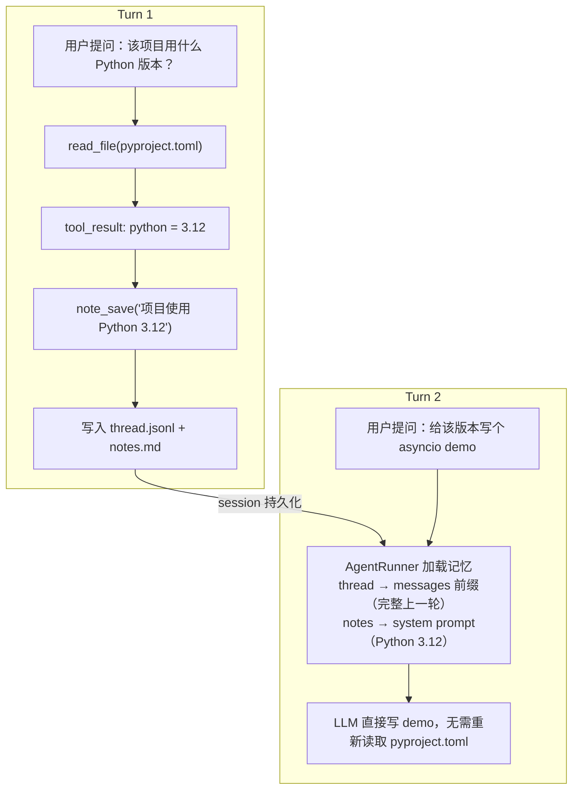

# AgentRunner：从 session 里恢复上下文

`SessionManager` 把 `session` 和 `store` 传给 `AgentRunner.run_and_capture`。runner 看到这两个参数，就不再创建一个孤立 run，而是从 session 里恢复上下文：

```python
# src/simple_agent/core/runner.py（节选）

async def run_and_capture(self, goal, *, run_id=None, session=None, store=None):
    run_id = run_id or new_run_id()
    if session is not None and store is not None:
        run_path = store.runs_dir(session.id) / run_id
        history = store.read_messages(session.id)
        notes = store.read_notes(session.id)
    else:
        run_path = self._runs_dir / run_id
        history = [{"role": "user", "content": goal}]
        notes = ""

    context = ExecutionContext(
        run_id=run_id,
        goal=goal,
        max_steps=self._config.agent.max_steps,
        prefill_messages=history,
        session_notes=notes,
    )
```

这里出现了 s4 的两层记忆：

- `thread.jsonl` 读出来变成 `history`，作为 `messages` 前缀。
- `notes.md` 读出来变成 `notes`，注入 system prompt。

这两层听起来都叫"记忆"，但职责不一样。

## 第二轮：记忆开始生效

第一轮结束后，chat 进入等待状态：

```python
if session.mode == "one_shot":
    session.status = "closed"
    await self._bus.publish(SessionClosedEvent(...))
else:
    session.status = "waiting_for_input"
    await self._bus.publish(SessionWaitingForInputEvent(...))
```

CLI 收到 `session.waiting_for_input`，打印：

```
[waiting for input]
```

用户输入第二句：

```
写一个适合该版本的新特性 demo
```

这一次 `send_message` 还是同样的路径：先追加 user 消息，再启动 run。但 `AgentRunner` 读到的 `history` 已经不是空的了：

```python
messages = [
    {"role": "user", "content": "项目用什么 Python 版本？"},
    {"role": "assistant", "content": [text_block, tool_use(read_file)]},
    {"role": "user", "content": [tool_result("requires-python >=3.12")]},
    {"role": "assistant", "content": [text_block("项目使用 Python 3.12")]},
    {"role": "user", "content": "写一个适合该版本的新特性 demo"},
]
```

同时 system prompt 里还有：

```
## Session Notes
Project uses Python 3.12.
```

LLM 现在同时看到两件事：

- thread 里有完整证据：上一轮读了 `pyproject.toml`，工具结果写着 Python 3.12。
- notes 里有整理后的事实：项目使用 Python 3.12。

所以它可以直接开始写 demo，而不是重新读取 `pyproject.toml`。



这就是 s4 的 payoff：多轮不是把上一轮终态文本拼到 prompt 里，而是把上一轮完整 API 消息流和主动笔记都带回来。
