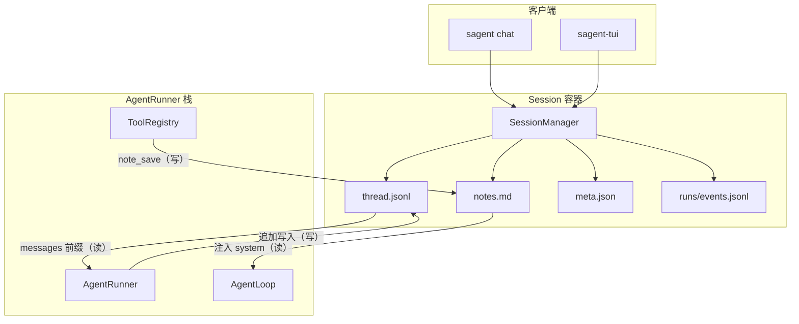

# S4-把 Agent 变成会话伙伴

## 第 4 阶段：把 Agent 变成会话伙伴

| 项目 | 内容 |
|------|------|
| **阶段** | s4 |
| **分支** | `stage/s4` |
| **本阶段新增** | Session 容器、thread/notes 分层记忆、`note_save` 工具、`sagent chat`、TUI 输入框 |
| **依赖上一阶段** | s3 的 AgentRunner、ToolRegistry、任务工具和终端 TUI；s2 的 IPC 事件流 |

## 本阶段要做什么

s3 结束时，agent 已经不只是"读一个文件、回答一个问题"了。它能自己创建任务、更新任务、运行 shell、写文件，甚至在 TUI 里把执行过程完整展示出来。

但它仍然有一个很硬的边界：**一次 run 结束之后，下一次 run 什么都不记得**。

试一下这个交互：

```bash
uv run sagent run --goal "项目用什么 Python 版本？"
```

agent 读了 `pyproject.toml`，回答："Python 3.12"。这时你接着想说：

```
那写一个适合该版本的新特性 demo
```

在 s3 里，这句话没有地方可说。你只能重新发一条 `sagent run`：

```bash
uv run sagent run --goal "写一个适合该版本的新特性 demo"
```

问题来了：这里的"该版本"指什么？上一轮的答案已经随着进程结束一起消失了。agent 要么重新读 `pyproject.toml`，要么猜错。

s4 要解决的就是这个问题：让多个 run 共享同一个 **Session**。s4 给 `sagent-tui` 底部加了输入框，用户不再每次都发一次独立命令，而是在 TUI 里进入持续会话：

```bash
uv run sagent-tui
```

TUI 启动后自动创建 chat session，底部输入框就绪。在输入框里输入第一条消息：

```
项目用什么 Python 版本？
```

按 Enter，输出区域流式展示工具调用和 agent 回答。完成后输入框重新激活，继续输入：

```
写一个适合该版本的新特性 demo
```

这一次 agent 不需要重新读 `pyproject.toml`。它从上一轮的 thread 里已经知道答案，直接开始写。

第二轮里，agent 不需要重新理解"该版本"。它能看到第一轮的对话、工具调用结果，也能看到自己主动保存的关键笔记。这就是 s4 的核心：**把 agent 从一次性任务执行者，变成能连续协作的会话伙伴**。

这一章的主线就是一次 `sagent-tui` 会话：用户启动 TUI，daemon 创建 session，用户在输入框发送第一条消息，AgentRunner 读取 thread 和 notes，run 结束后写回记忆，然后第二条消息复用这些记忆。

## Session 记忆模型：两层存储，四条读写路径


